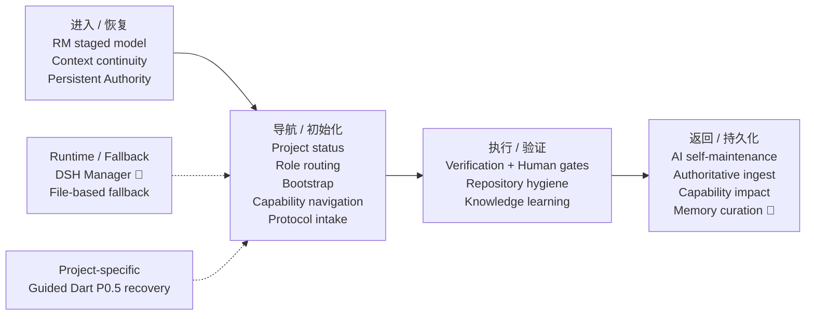

# System Capability Index — rm-ai-control_v1.2

> 回答“系统已经会什么、我什么时候需要它、入口在哪里、当前是否可用”。
>
> Capability 是可执行的功能，不是文件清单。本页是导航，不替代链接指向的规则、状态或验证证据。

## Quick Summary

- **Total:** 18
- **Active:** 16
- **Experimental:** 2
- **Planned:** 0
- **Deprecated:** 0

状态只使用 `Active`、`Planned`、`Experimental`、`Deprecated`。图中只显示工作关系；正式状态、Owner 与来源以各能力卡片为准。

## Capability Map

## 按当前意图查找

- **进入项目、恢复上下文或长期身份：** RM staged operating model、Context health and minimum-sufficient handoff、Persistent Authority / Long-lived Role Continuity。
- **查看状态、寻找角色或初始化工作：** Project status navigation、Role and conversation routing、Minimum bootstrap assembly、Protocol release intake、Capability navigation and gap observation。
- **执行、验证或学习：** Verification levels and Human gates、Repository hygiene、Knowledge learning and note lifecycle。
- **返回结果并持久化：** Project AI self-maintenance、Authoritative state ingest、Capability impact reporting、Persistent memory and artifact curation。
- **使用控制面 Runtime 或降级入口：** DSH + DeepSeek Manager execution、File-based Manager fallback。
- **恢复特定项目状态：** Guided Dart P0.5 state recovery。

---

## 进入 / 恢复

### RM staged operating model · `Active`

- **何时使用：** 进入项目、分阶段推进或判断角色职责时。
- **提供能力：** 以 P0 / P1 / P2 和 Supervisor / Specialist / Work 边界组织 RM 项目工作。
- **入口：** [Protocol START_HERE](../../protocol/current/RM_AI_Development_Protocol_v2.3_Frozen/START_HERE.md)
- **Owner：** rm-ai-control Maintainer
- **Category：** Core Protocol

### Context health and minimum-sufficient handoff · `Active`

- **何时使用：** Re-anchor、Checkpoint、Handoff、Carry Forward，或上下文退化、换角色、换对话时。
- **提供能力：** 恢复关键锚点并传递最小充分信息。
- **入口：** [Context Health](../../protocol/current/RM_AI_Development_Protocol_v2.3_Frozen/common/Context_Health.md) · [Handoff Protocol](../../protocol/current/RM_AI_Development_Protocol_v2.3_Frozen/common/Handoff_Protocol.md) · [Carry Forward](../../protocol/current/RM_AI_Development_Protocol_v2.3_Frozen/common/Carry_Forward.md)
- **Owner：** rm-ai-control Maintainer
- **Category：** Core Protocol

### Persistent Authority / Long-lived Role Continuity · `Active`

- **何时使用：** 首次启动、上下文恢复、长时间中断、权限敏感操作、正式 Artifact 晋升，或核对 Anchor / Authority 依赖时。
- **提供能力：** 通过 Canonical Role Anchor、可读取的 Runtime Delivery Copy、Authority dependency resolution、Recovery Gate 与 Promotion Gate 恢复长期角色的稳定身份和权威边界。
- **入口：** [Authority Index](../authority/AUTHORITY_INDEX.md) · [Universal AI Behavior](../ai/UNIVERSAL_PROJECT_AI_BEHAVIOR.md) · [Role Anchor Template](../templates/ROLE_ANCHOR_TEMPLATE.md) · [Code Framework Analyst Anchor](../authority/role-anchors/AUTO_AIM_CODE_FRAMEWORK_ANALYST_ROLE_ANCHOR.md) · [Authority Recovery Instructions](../templates/PROJECT_AUTHORITY_RECOVERY_INSTRUCTIONS.md)
- **Owner：** rm-ai-control Maintainer / Manager / each anchored role
- **Category：** Universal Capability

---

## 导航 / 初始化

### Project status navigation · `Active`

- **何时使用：** 用户询问当前状态、阻塞、活跃入口或 freshness 时。
- **提供能力：** 从 Control Index 与权威产物恢复项目当前地图，并区分事实与 Unknown。
- **入口：** [Manager Skill](../../.agents/skills/rm-project-manager/SKILL.md) · [Project Control Index](PROJECT_CONTROL_INDEX.md)
- **Owner：** Manager
- **Category：** Universal Capability

### Role and conversation routing · `Active`

- **何时使用：** 用户询问下一步应进入哪类工作入口时。
- **提供能力：** 将任务导航到已有 Main Supervisor、Specialist、Knowledge Conversation 或 Work / Executor。
- **入口：** [Manager Charter](../../MANAGER_CHARTER.md) · [Manager Skill](../../.agents/skills/rm-project-manager/SKILL.md)
- **Owner：** Manager
- **Category：** Universal Capability

### Minimum bootstrap assembly · `Active`

- **何时使用：** 新建或续接 Plain Conversation、Specialist、Knowledge Conversation 或 Work 时。
- **提供能力：** 根据 Target Execution Surface 与 Execution Contract，以 Overview + Relevant Detail 组装可执行、最小充分的上下文。
- **入口：** [Bootstrap Packet Template](../templates/BOOTSTRAP_PACKET_TEMPLATE.md) · [Manager Skill](../../.agents/skills/rm-project-manager/SKILL.md)
- **Owner：** Manager
- **Category：** Universal Capability

### Protocol release intake · `Active`

- **何时使用：** 收到正式 PROTOCOL_RELEASE_PACKET 时。
- **提供能力：** 登记 Protocol Release、迁移要求和不变项，不把协议变化误写成项目状态。
- **入口：** [Protocol Release Packet Template](../templates/PROTOCOL_RELEASE_PACKET_TEMPLATE.md) · [Manager Skill](../../.agents/skills/rm-project-manager/SKILL.md)
- **Owner：** Manager / rm-ai-control Maintainer
- **Category：** Universal Capability

### Capability navigation and gap observation · `Active`

- **何时使用：** 用户询问“系统会什么 / 怎么用”，或观察到现有能力无法覆盖真实需求时。
- **提供能力：** 查询已有能力、定位入口，并把有证据的 Gap 交给 Maintainer 裁决。
- **入口：** 本文件 · [Manager Charter](../../MANAGER_CHARTER.md)
- **Owner：** Manager
- **Category：** Universal Capability

---

## 执行 / 验证

### Verification levels and Human gates · `Active`

- **何时使用：** 报告验证结果、进入高风险步骤，或遇到必须由用户决定的事项时。
- **提供能力：** 区分验证强度并保护必须由 Human 决定的边界。
- **入口：** [Verification Levels](../../protocol/current/RM_AI_Development_Protocol_v2.3_Frozen/shared/Verification_Levels.md) · [Human / AI Gates](../../protocol/current/RM_AI_Development_Protocol_v2.3_Frozen/shared/Human_AI_Gates.md)
- **Owner：** rm-ai-control Maintainer / Human
- **Category：** Core Protocol

### Repository hygiene · `Active`

- **何时使用：** 任何有仓库写入的任务开始、提交前与结束时。
- **提供能力：** 保护既有用户修改、Secret 和可恢复的 Git 历史。
- **入口：** [Universal AI Behavior](../ai/UNIVERSAL_PROJECT_AI_BEHAVIOR.md)
- **Owner：** Each writing AI
- **Category：** Universal Capability

### Knowledge learning and note lifecycle · `Active`

- **何时使用：** 真实项目出现知识断点，或需要形成、更新、合并笔记时。
- **提供能力：** 支持知识学习、Learning State、知识资产导航和笔记生命周期。
- **入口：** [Knowledge Learning and Notes](../../protocol/current/RM_AI_Development_Protocol_v2.3_Frozen/playbooks/knowledge/KNOWLEDGE_LEARNING_AND_NOTES.md)
- **Owner：** rm-ai-control Maintainer / User
- **Category：** Core Protocol

---

## 返回 / 持久化

### Project AI self-maintenance · `Active`

- **何时使用：** 关键事件、上下文转黄 / 红、交接或阶段报告时。
- **提供能力：** 让具备项目职责的 AI 维护自己的 Goal、Verified Facts、Decisions、Unknowns、Current Work、Next Step。
- **入口：** [Universal AI Behavior](../ai/UNIVERSAL_PROJECT_AI_BEHAVIOR.md)
- **Owner：** Each project-role AI
- **Category：** Universal Capability

### Authoritative state ingest · `Active`

- **何时使用：** 收到 STATE_UPDATE、Checkpoint、Return、Project State 或正式报告时。
- **提供能力：** 审查并持久化正式状态输入，同时保留来源并阻止未经授权的语义升级。
- **入口：** [Artifact Lifecycle](../governance/ARTIFACT_LIFECYCLE.md) · [State Update Template](../templates/STATE_UPDATE_TEMPLATE.md)
- **Owner：** Manager interprets / Memory Curator persists
- **Category：** Universal Capability

### Capability impact reporting · `Active`

- **何时使用：** Checkpoint、Task Report、Specialist Return、Stage Report 或 STATE_UPDATE 涉及长期功能变化时。
- **提供能力：** 用统一的小字段把 Capability 影响通知 Manager。
- **入口：** [Capability Impact Template](../templates/CAPABILITY_IMPACT_TEMPLATE.md)
- **Owner：** Reporting role / Manager
- **Category：** Universal Capability

### Persistent memory and artifact curation · `Experimental`

- **何时使用：** Returned Artifact、Confirmed State Delta、Consumed Artifact Event，或长期状态导航需要持久化时。
- **提供能力：** 按 Artifact Lifecycle 接收、分类、持久化、索引和归档状态，同时表达 freshness 与 Pending Update。
- **入口：** [Artifact Lifecycle](../governance/ARTIFACT_LIFECYCLE.md) · [Curator Update Packet](../templates/CURATOR_UPDATE_PACKET_TEMPLATE.md) · [Curator Receipt](../templates/CURATOR_RECEIPT_TEMPLATE.md) · [Memory Index](../memory/MEMORY_INDEX.md) · [Memory Curator Charter](../../MEMORY_CURATOR_CHARTER.md)
- **Owner：** Memory Curator / Repo Operator
- **Category：** Universal Capability

---

## Runtime / Fallback

### DSH + DeepSeek Manager execution · `Experimental`

- **何时使用：** 需要通过实际 DeepSeek Manager 操作控制仓库时。
- **提供能力：** 使用固定版本 DSH 和配置化 Provider / Model 执行 Manager 五项核心意图。
- **入口：** [Manager Runtime Status](../../runtime/dsh-pilot/MANAGER_RUNTIME_STATUS.md)
- **Owner：** Manager Runtime operator
- **Category：** Specialized Capability

### File-based Manager fallback · `Active`

- **何时使用：** Runtime、网络、额度或 Provider 不可用时。
- **提供能力：** 使用同一套仓库状态恢复 Manager，不依赖 DSH / DeepSeek 会话。
- **入口：** [Manager Runtime Fallback](../../runtime/dsh-pilot/MANAGER_RUNTIME_STATUS.md#fallback)
- **Owner：** Manager operator
- **Category：** Specialized Capability

---

## Project-specific

### Guided Dart P0.5 state recovery · `Active`

- **何时使用：** 查询或续接 Guided Dart 当前工作时。
- **提供能力：** 从当前权威 Checkpoint 恢复制导镖 P0.5 状态并导航下一工作入口。
- **入口：** [Project Control Index](PROJECT_CONTROL_INDEX.md) · [Guided Dart P0.5 Checkpoint](../../projects/guided-dart/GUIDED_DART_P0_5_CHECKPOINT.md)
- **Owner：** Manager / Guided Dart project roles
- **Category：** Project-specific Capability

---

## Authority and Maintenance

- 本索引是能力导航，不替代其 Entry / Source 指向的规则、状态或验证证据。
- Manager 负责 Capability Navigation 和 Gap Observation；Capability 定义变化由 rm-ai-control Maintainer 裁决、Repo Operator 确定性落盘。
- Manager 可以记录 Capability Gap；没有 Maintainer / Human 的明确授权与实现证据，不得自行把 Gap 登记成新 Capability。
- Core Protocol 的语义只能由正式 Protocol Release 改变。

## Status Change Record

> `Persistent Authority / Long-lived Role Continuity`：`Experimental` → `Active`，2026-09-21。
>
> - **决定来源：** Human Confirmed（用户直接指令，2026-09-21）。原 v1.2 登记条件为“需持续真实使用验证”，该条件已由下述证据满足。
> - **依据证据：** Role Anchor `auto-aim-code-framework-analyst` `1.1` 在 ChatGPT Project Runtime 中 Authority Recovery `PASS`、Artifact Promotion Gate `PASS`、Role Anchor Version Recovery `1.1` `PASS`（2026-09-19）；并在 2026-09-20 的持续真实使用中再次 Authority Recovery `SUCCESS`（`Runtime Authority Gap: None`）。证据见 [Archive Returns](../../archive/returns/) 与 [Inbox](../../inbox/)。
> - **落盘范围：** 仅本 Capability 的 `Status` 字段。**未改动** Capability 的名称、Purpose、When to Use、Entry / Source、Owner，也未改动 Core Protocol、方法论或任何角色权限。
> - **边界说明：** Capability 定义变化按 [Repository README](../../README.md) 与本文件 Authority and Maintenance 规则，通常由 rm-ai-control Maintainer 裁决、Repo Operator 确定性落盘；本次是 Human 直接指令下的状态字段落盘，由 Memory Curator 执行并留痕，**不构成先例**。
> - **验证范围：** 截至 2026-09-21，仅验证 **1 个 anchored role / 1 个 Runtime Surface（ChatGPT Project）**；多角色、多 Runtime Surface 尚未验证。

## Planned Capabilities

当前没有由权威产物登记为 `Planned` 的 Capability。

## Capability Gap Observations

Manager 仅记录有来源的缺口，不把缺口自动升级为能力。记录时使用：

- Observed Gap：
- Evidence / Source：
- Operational Impact：
- Existing Capability Checked：
- Decision Needed From：`rm-ai-control Maintainer / Human`

当前没有已登记的 Capability Gap。
