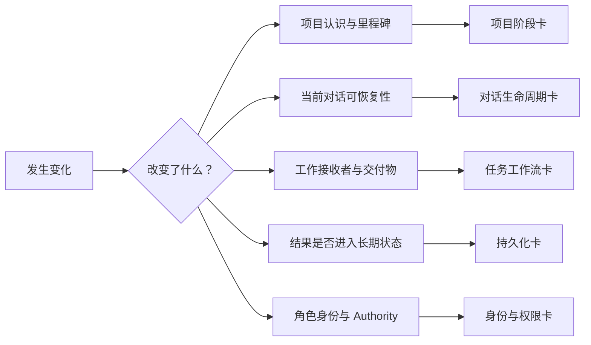

# Human Template Guide — Stage Recognition Map

> Status: Current module of the Human Template Guide
> Audience: Human operator
> Purpose: 先选对判断板块，再进入对应短卡片；本文不承载全部细节。
> Authority Boundary: 本模块是 Human 导航；链接来源决定正式语义。

## 1. 先问一个问题

**这次变化，究竟改变了什么？**

## 2. 选择对应卡片

### 项目认识或里程碑变了

例如：从领域了解转为正式接手，或首个里程碑已经明确。

阅读：[PROJECT_STAGES.md](stage-recognition/PROJECT_STAGES.md)

### 项目没变，但对话开始失真或需要迁移

例如：上下文混乱、同一阶段换对话、Supervisor 更换。

阅读：[CONVERSATION_LIFECYCLE.md](stage-recognition/CONVERSATION_LIFECYCLE.md)

### 要把研究或执行工作交给另一个单元

例如：派 Specialist 深挖问题，或派 Executor 实现与测试。

阅读：[TASK_WORKFLOW.md](stage-recognition/TASK_WORKFLOW.md)

### 已有结果，但不确定是否要长期记录

例如：任务已完成，但尚未判断是否应由 Curator 持久化。

阅读：[PERSISTENCE.md](stage-recognition/PERSISTENCE.md)

### 新对话需要初始化，或长期角色需要恢复

例如：要交付 Bootstrap、Role Anchor 或 Authority Recovery Instructions。

阅读：[IDENTITY_AND_AUTHORITY.md](stage-recognition/IDENTITY_AND_AUTHORITY.md)

## 3. 一次事件可能需要多张卡

- P2 完成并换对话：项目阶段卡 + 对话生命周期卡。
- Supervisor 派出 Executor：任务工作流卡；项目阶段通常不变。
- Executor 返回重要结果：任务工作流卡 + 持久化卡。
- 长期角色由新 AI 接任：身份与权限卡；若对话同时失真，再看对话生命周期卡。

不要试图用一张模板包办所有层。

## 4. Human 应暂停裁决的情况

- 无法判断究竟是哪一层发生变化；
- 当前事实与 Authority、State 或已批准决策冲突；
- 模板存在，但正式状态或版本不明确；
- 执行体要求超出 Brief 的修改权或决策权；
- 对方无法访问任务所依赖的材料；
- 下一位消费者、输出位置或验收标准不明确。

若只是想快速开始，请先回到 [START_HERE.md](START_HERE.md)。
