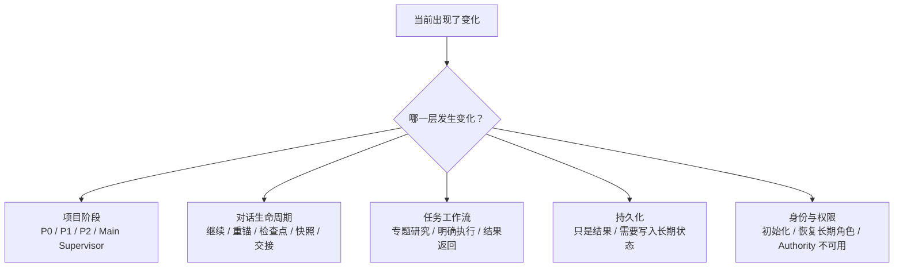

# Human Template Guide — Start Here

```yaml
Artifact Type: Human Operations Guide
Scope: Universal stage recognition, specialized task routing, template delivery
Producer: rm-ai-control Maintainer
Created: 2026-09-27
Lifecycle: Current
Semantic Authority: Human Confirmed
Authoritative Source: control/dashboard/human-template-guide/START_HERE.md (navigation); linked canonical sources govern semantics
Supersedes: None
Next Consumer: None
```

> Audience: Human operator
> Purpose: 帮助 Human 独立判断“现在发生了哪类变化，以及下一步应提供哪一类模板”。
> Boundary: 本指南是 Current Human 导航，不是 Authority，也不替代正式协议、模板或索引。
> Collection Boundary: 本目录中由本入口链接的文件都是该 Current Guide 的模块；任何单独卡片都不自行授予 Authority。

## 1. 先判断：变化发生在哪一层

不要一看到“要换对话”或“要开始工作”就立刻寻找模板。先判断变化属于哪一层：



一次事件可能同时涉及两层。例如：

- P2 已完成，同时要更换对话：这是“项目阶段完成”加“对话迁移”；
- Supervisor 仍在原里程碑，但要更换执行体：这是“任务工作流变化”，不一定是项目阶段变化；
- 得到了重要结论，但尚未批准写入长期记录：这是“任务结果已产生”，但“持久化尚未完成”。

## 2. 30 秒判断路线

### A. 项目本身进入了新阶段吗？

- 还在了解陌生领域：P0。
- 已正式接手，但团队现实不清：P1。
- 团队现实已知，但项目入口与首个里程碑不清：P2。
- 首个里程碑与当前事实已清楚，准备持续推进：Main Supervisor。

如果答案是“没有”，不要因为换了对话或换了 AI 就重走 P0/P1/P2。

### B. 只是对话寿命或上下文发生变化吗？

- 目标、事实、决策、边界、下一步都能恢复：继续，不需要额外文档。
- 开始混淆旧结论、分支或边界：先重锚；必要时形成 Checkpoint。
- 已不能可靠恢复当前事实，或与持久化事实冲突：停止高风险判断，先恢复或交接。
- 同一阶段未完成但必须换对话：Checkpoint。
- Supervisor 要更换：Supervisor Snapshot。
- 阶段已经完成：Report，而不是 Checkpoint。

### C. 是否要把工作交给另一个执行单元？

- 要研究一个边界清楚、需要独立深入的问题：Specialist Brief。
- 要完成明确的实现、修改、测试或交付：Task Brief。
- Specialist 要把结论送回主线：Specialist Return。
- Executor 要报告完成情况与验证证据：Task Report。

简单、低风险、可直接完成的工作不必强制分派。

### D. 结果是否需要进入长期状态？

- 只服务于当前任务或上游决策：先返回上游，不必立即持久化。
- 会改变项目的长期当前事实、决策、资产或待办：进入持久化判断，准备交给 Curator 的输入。
- 未得到相应授权：不要直接修改 Authority、索引或长期记忆。

具体“交给 Curator 哪些材料”见 [Template Delivery Guide](TEMPLATE_DELIVERY.md) 与 [Persistence Card](stage-recognition/PERSISTENCE.md)。

### E. 是否涉及接收者初始化或角色恢复？

- 新接收者或不确定起点：使用 Bootstrap Packet 装配材料；若是续接既有工作，同时带对应 Checkpoint、Snapshot 或 Report。
- 长期正式角色首次建立：Bootstrap + 已批准的 Role Anchor。
- 长期角色恢复：Role Anchor + Authority Recovery Instructions，并核验身份与版本。
- Authority 无法取得或相互冲突：可以继续非正式讨论，但暂停正式晋升、改写与高风险决策。

## 3. 提供模板前的四个检查

1. **目标产物是什么？** 是继续讨论、阶段记录、正式交付，还是长期持久化。
2. **下一位消费者是谁？** Human、Manager、Supervisor、Specialist、Executor 或 Curator。
3. **对方能否读取仓库？** 不要假设所有对话都能访问路径。
4. **这是正式产物吗？** 若是，至少要明确 Trigger、Template、Generation Prompt、Output File、Next Consumer。

## 4. 不同运行表面的最低交付规则

- **普通对话**：路径只能说明来源；必须上传文件、附上内容或以内联方式提供必要材料。
- **本地工作**：确认工作目录与读取权限后，才可仅提供仓库路径。
- **云端工作**：必须确认对应仓库、分支或提交已经同步并可访问；本指南不假定云端天然看得到本地文件。
- **其他 AI 或执行体**：按其实际读取能力交付；名称相同不代表能力相同。

## 5. 接下来读什么

需要判断具体阶段和模板类别时，阅读：

- [STAGE_RECOGNITION.md](STAGE_RECOGNITION.md)

已经知道处于什么阶段，需要判断当前任务是否要附加笔记、调试、联调、重构等专用规则时，阅读：

- [Specialized Task Guide](specialized/INDEX.md)

已经确定模板与材料，需要判断如何真正交给普通对话、本地工作、云端工作或其他 AI 时，阅读：

- [Template Delivery Guide](TEMPLATE_DELIVERY.md)

需要核对现有正式模板与来源时，阅读：

- [Template Resolution Catalog](../../ai/TEMPLATE_RESOLUTION_CATALOG.md)
- [Protocol Start Here](../../../protocol/current/RM_AI_Development_Protocol_v2.3_Frozen/START_HERE.md)
- [Protocol Usage Guide](../../../protocol/current/RM_AI_Development_Protocol_v2.3_Frozen/USAGE_GUIDE.md)

阶段指南与特化任务指南是两条独立轴线：前者判断工作状态，后者判断当前任务需要哪份按需材料。二者可以同时使用，但都不承担完整能力百科的职责。
