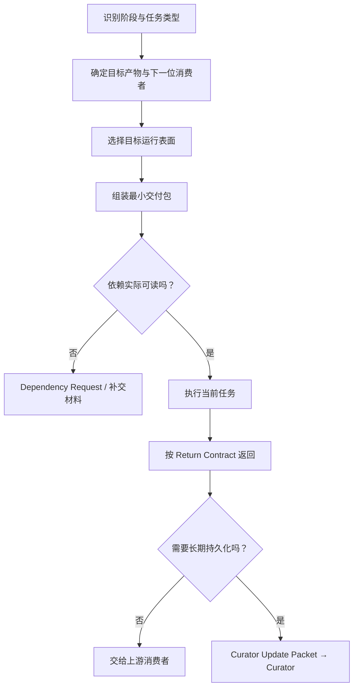

# Human Template Guide — Template Delivery

> Status: Current module of the Human Template Guide
> Audience: Human operator
> Purpose: 已判断出阶段与任务类型后，把必要模板、Authority 和任务材料真正交付给目标 AI。
> Boundary: 本模块不改变任何产品权限，也不保证普通对话永久记住已交付规则；链接来源决定正式语义。

## 1. 完整路线



## 2. 先选择运行表面

### 普通 Chat 或 ChatGPT Project 中的 Chat

不能假设能读取本机路径。项目 Chat 可以共享项目中已上传的文件、项目说明和连接来源，但仍不等于本机目录访问。

阅读：[CHAT.md](delivery/CHAT.md)

### Work Local / 本地 Codex

可以在授权范围内使用本机文件和工具，但必须确认工作目录、权限、Git 状态和文件实际可读。

阅读：[WORK_LOCAL.md](delivery/WORK_LOCAL.md)

### Work Cloud / Codex Cloud

云端不能直接读取本机文件。一般 Work Cloud 通过上传、Project Sources 或连接应用获得材料；仓库执行需要连接 Git 仓库并配置云端环境。

阅读：[WORK_CLOUD.md](delivery/WORK_CLOUD.md)

### DSH、其他 AI 或临时执行体

先声明真实能力，再决定使用路径交付还是自足交付包。模型名称不能代替能力核验。

阅读：[OTHER_EXECUTORS.md](delivery/OTHER_EXECUTORS.md)

## 3. 所有表面共用的两张卡

- 如何组成最小交付包：[DELIVERY_PACKAGE.md](delivery/DELIVERY_PACKAGE.md)
- 缺少模板、Authority 或材料时怎么办：[DEPENDENCY_GATE.md](delivery/DEPENDENCY_GATE.md)

## 4. 三层投放

```text
长期层
= 稳定项目说明、Role Anchor、必要 Authority Runtime Copy

会话层
= Bootstrap 交付外壳 + Checkpoint / Snapshot / Report 等状态来源

任务层
= Brief、专用 Playbook、源材料、验收标准、Return Contract
```

只把稳定且跨任务持续有效的内容放进长期层。当前里程碑、临时判断和本轮任务不要塞进长期项目说明。

## 5. Human 最少确认五件事

1. 对方在哪个运行表面工作？
2. 对方实际能读什么、能写什么？
3. 哪些 Authority、模板和任务材料必须在开始前可读？
4. 最终应返回什么，由谁消费？
5. 结果是否需要 Curator 持久化？

若这五项不能回答，不要仅发送一句“按项目规范做”。

## 6. 触发核验的时机

不需要每轮检查。只在以下事件核验：

- 新对话、新角色或新执行体开始；
- 正式 Artifact 或受规范约束的工作开始；
- 上下文已经 Yellow / Red；
- 准备把 Draft 晋升为 Formal / Persistent / Authoritative；
- 运行表面、仓库分支、Role Anchor 或 Authority 版本发生变化。

## 7. 产品事实来源

以下产品边界于 2026-09-27 根据 OpenAI 官方文档核对；产品能力仍受账户、权限、Workspace Policy 和后续更新影响：

- [Projects and chats](https://learn.chatgpt.com/docs/projects)
- [Get started with ChatGPT Work](https://learn.chatgpt.com/docs/get-started-with-work)
- [Codex cloud](https://learn.chatgpt.com/docs/cloud)

仓库内正式解析入口仍是：[Template Resolution Catalog](../../ai/TEMPLATE_RESOLUTION_CATALOG.md)。
