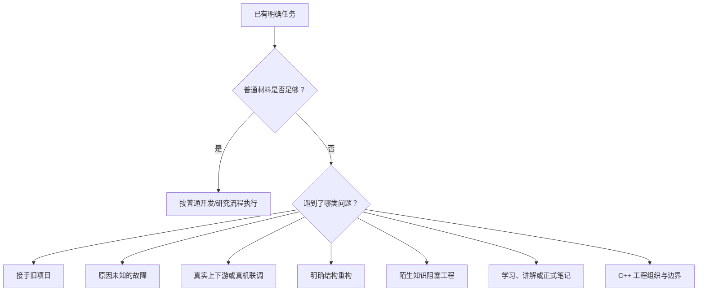

# Specialized Task Guide — Index

> Status: Current module of the Human Template Guide
> Audience: Human operator
> Purpose: 已经知道任务阶段后，判断是否需要附加某套专用 Playbook、规则或状态材料。
> Naming Boundary: 这里使用描述性任务名称，不创建新的正式 Capability 名称；链接来源决定正式语义。

## 1. 先判断是否真的需要特化材料

Playbook 是按需材料，不是每个下游对话都要加载的启动包。

## 2. 快速路由

### 普通实现、修改或测试

任务已经清楚，只需实现和验证：

- [DEVELOPMENT_EXECUTION.md](DEVELOPMENT_EXECUTION.md)

### 第一次接手已有仓库

需要先建立运行、使用、调参与诊断控制力：

- [PROJECT_ASSIMILATION.md](PROJECT_ASSIMILATION.md)

### 原因未知的故障

需要建立假设、证据和受控实验，而不是直接叠修复：

- [DEBUG_EXPERIMENT.md](DEBUG_EXPERIMENT.md)

### 联调、硬件或真实机器人

涉及真实上下游、通信、执行器或安全边界：

- [INTEGRATION_SAFETY.md](INTEGRATION_SAFETY.md)

### 已明确要重构或收敛结构

当前结构已经产生真实阻塞、重复或长期混乱：

- [ARCHITECTURE_REFACTOR.md](ARCHITECTURE_REFACTOR.md)

### 陌生知识阻塞当前工程

还不知道值不值得深入，或需要学到什么程度才够：

- [LEARNING_KNOWLEDGE_DEBT.md](LEARNING_KNOWLEDGE_DEBT.md)

### 已决定学习、讲解或形成正式笔记

需要知识状态、讲解规则、笔记整理或知识资产更新：

- [KNOWLEDGE_AND_NOTES.md](KNOWLEDGE_AND_NOTES.md)

### C++ 工程目录、模块边界与运行时设施

讨论 main、组件、I/O、Observability、Record/Replay、Config 或 tools：

- [CPP_ARCHITECTURE.md](CPP_ARCHITECTURE.md)

## 3. “项目审查”不是一个固定入口

现有协议没有名为“通用项目审查”的单一 Playbook。应按审查目的路由：

- 为接手旧仓库建立控制力 → Project Assimilation；
- 查找未知故障根因 → Debug / Experiment；
- 判断结构是否需要收敛 → Architecture / Refactor；
- 审查 C++ 模块组织 → C++ Architecture；
- 审查明确实现是否完成 → 普通开发执行 + Verification Levels；
- 审查 `rm-ai-control` 自身方法与 Authority → Maintainer 职责，不属于 RM 业务特化卡。

不要只凭“审查”两个字一次加载全部 Playbook。

## 4. 组合规则

- 一项任务可以使用一张主卡，并按真实需要增加一张辅卡。
- 原因未明时先 Debug；根因与修复方案明确后再切回 Development。
- 开发中发现结构问题，不自动切换为 Architecture；只有真实阻塞或 Human 授权才切换。
- 知识阻塞先判断所需理解深度；确定要学习或整理笔记后才进入 Knowledge Layer。
- 真机、联调和安全相关任务优先叠加 Integration Safety。

## 5. 交付原则

Human 或 Manager 只向下游提供当前任务需要的卡片、Canonical Playbook 和任务材料。普通对话不能只收到路径；本地或仓库执行体也必须先确认文件实际可读。

具体按运行表面交付的方法见：[Template Delivery Guide](../TEMPLATE_DELIVERY.md)。

正式场景目录：[Playbook Index](../../../../protocol/current/RM_AI_Development_Protocol_v2.3_Frozen/PLAYBOOK_INDEX.md)
